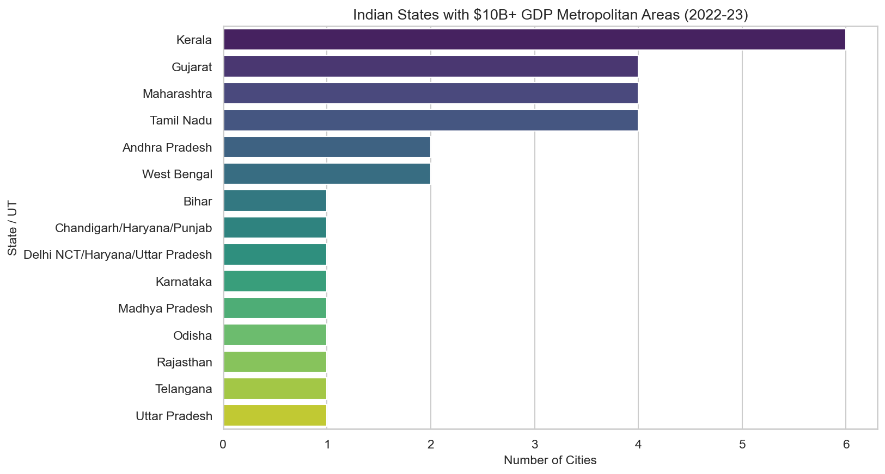

<p align="center">
  
</p>

# 🇮🇳 Indian Metros Economy & GDP Analyzer

[](https://www.python.org/)
[](https://pandas.pydata.org/)
[](https://seaborn.pydata.org/)
[](LICENSE)

An elegant 📊 data analysis and 🎨 visualization tool that explores the economic scale of **Indian metropolitan areas**. This project processes local GDP statistics to identify, rank, and visualize states containing high-economic-output (>$10B USD GDP) metropolitan zones.

### 🔍 Explore economic data for major Indian cities:
* **Delhi NCR**, **Mumbai**, **Bengaluru**, **Chennai**, **Hyderabad**, **Kolkata**, **Ahmedabad**, **Pune**, and more.
* Learn which Indian states host the highest number of cities with a GDP exceeding $10 Billion USD.
* Perfect for researchers, students, and data analysts interested in the economic footprint and metropolitan development of India.

---

## 🚀 Key Features

*   📊 **Curated GDP Dataset (`data.json`)**: Contains details of over 50 major metropolitan areas across India, their ranking, state representation, and GDP in USD billions.
*   🧹 **High-Yield Filtering**: Automatically filters and highlights economic hubs contributing over **$10 Billion USD** to the GDP.
*   📈 **Stunning Visualizations**: Aggregates city counts per state and generates ready-to-publish bar charts using `seaborn` and `matplotlib`.
*   🖼️ **Auto-export**: Saves high-resolution visualizations directly to the `assets/` directory.

---

## 🖼️ Sample Economic Visualization

The project maps out the distribution of these massive economic engines (GDP $\ge$ $10B) across various Indian States and Union Territories:

<p align="center">
  
</p>

---

## 🛠️ Tech Stack & 📚 Dependencies

The project relies on standard Python data science libraries:

*   🐍 **Python 3.8+**
*   🐼 **Pandas** - Data manipulation & aggregation
*   📊 **Matplotlib & Seaborn** - High-fidelity chart plotting & styling

---

## ⚙️ Installation & 🏃 Usage

### 📥 1. Clone the repository and navigate to the project directory
```bash
git clone https://github.com/ishandutta2007/Indian-Metros.git
cd Indian-Metros
```

### 📦 2. Install required dependencies
```bash
pip install pandas matplotlib seaborn
```

### ⚡ 3. Run the ranking script
```bash
python states_ranked.py
```

Running the script will update and show the plot, saving the high-DPI output to `assets/states_rank.png`.

---

## 📂 Project Structure

```
├── assets/
│   └── states_rank.png    # Generated high-resolution visualization
├── data.json              # Source GDP data of metropolitan areas
├── states_ranked.py       # Python script for filtering, aggregation & plotting
├── LICENSE                # MIT License details
└── README.md              # Project documentation
```

---

## 📝 License

This project is licensed under the MIT License. See the [LICENSE](LICENSE) file for details.